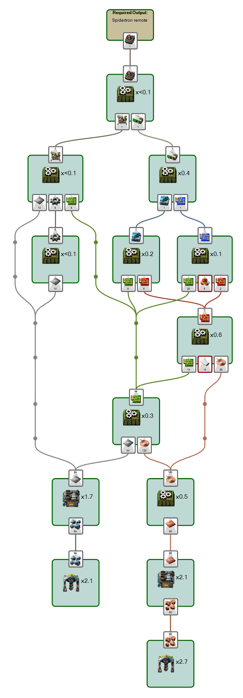

# Foreman 2.0 with graph layout

This is a fork of [Foreman 2.0](//github.com/DanielKote/Foreman2) with some
experimental support for automatic graph layout.

# Contributing / Reusing

This is just my personal playground. I think any contribution should go to the 
main repository. Having said that, if you have contributions specifically to
the graph layout part: Send me a pull request.

Also, in general, feel free to take any part of this and use it in any way
consistent with the [license](LICENSE.md).
